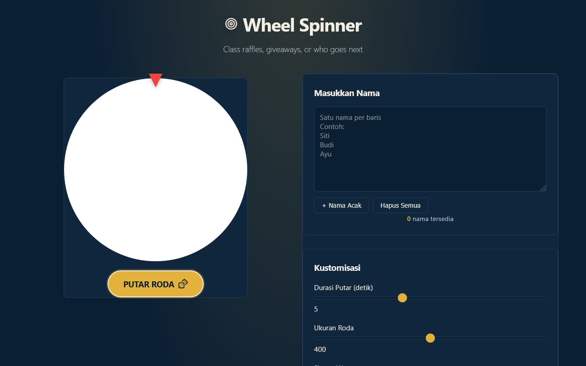

# Wheel Spinner

Pick a name at random for raffles, classrooms, or “who goes next.”



**Live demo:** [https://rogue-dev-studio.github.io/wheel-spinner-app/](https://rogue-dev-studio.github.io/wheel-spinner-app/)

## Highlights
- Spin length and wheel size
- Color schemes
- Optional remove-winner + JSON save/load

## Run
Open `index.html` locally (Live Server on port **5500**), or use the live demo above.

```bash
git clone https://github.com/rogue-dev-studio/wheel-spinner-app.git
```

By [Aris Hadisopiyan](https://rogue-dev-studio.github.io/) / Rogue Dev Studio.

MIT
